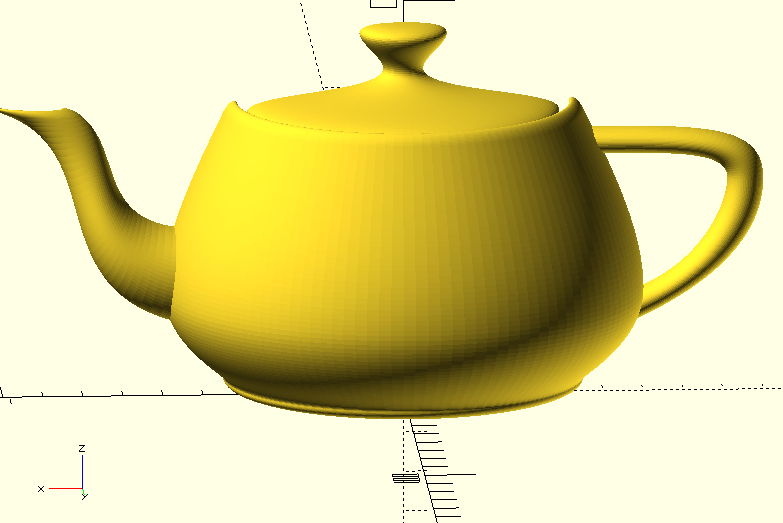

# Teapot
Martin Newell's Teapot in OpenSCAD

This is a work in progress.

It does in fact, use BOSL2 to render the classic teapot,
but because I haven't closed off the ends to make watertight, manifold, shapes
OpenSCAD can't render it for printing.

